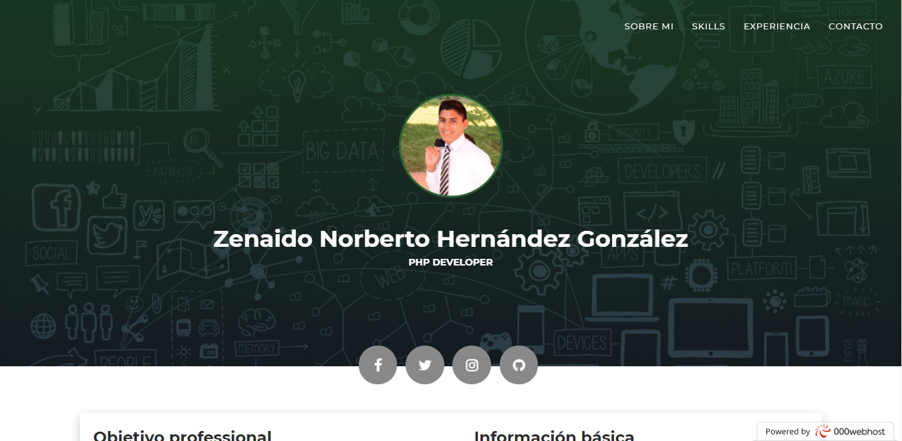

## CV online

Aplicacion realizada en laravel 5.6, para un CV online y con panel de administracíon básico con AdminLTE

<<<<<<< HEAD
=======

## FRONT 
https://znhgcurriculum.000webhostapp.com/
>>>>>>> 92edc9327ed706c79de85f52d9ff2f3bae58474f

## FRONT

https://znhgcurriculum.000webhostapp.com/

## BACK

